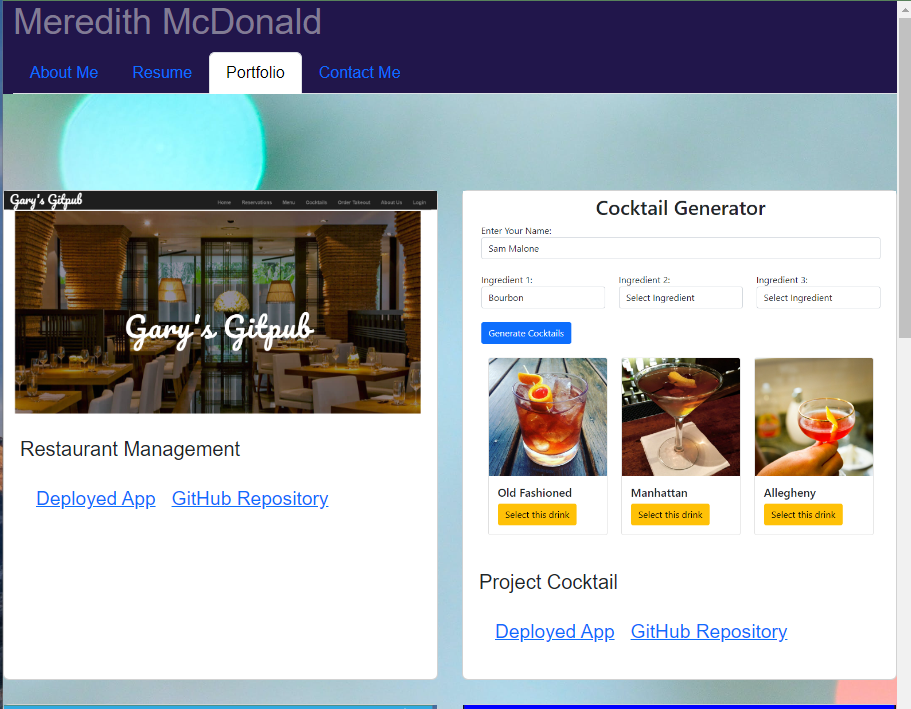

# Meredith McDonald's Portfolio

## Description

A professional portfolio created to display my knowledge of building fullstack web applications. This portfolio utilizes React, vite, JavaScript, CSS/Bootstrap, JSON, Linting, and is a culmination of all the front-end coding skills I have learned throughout the University of Minnesota Full Stack Bootcamp. The portfolio itself does have full stack applications to review. 

## Table of Contents

- [Installation](#installation)
- [Screenshot](#screenshot)
- [License](#license)
- [Questions](#questions)

## Installation

No installation is needed. Simply follow the link to view the application: https://meredith-mcdonald-portfolio.netlify.app/

## Screenshot

## License

  This application is covered under the MIT license.
  Please follow the link to learn more about the license: [License Information](https://opensource.org/licenses/MIT)
  

## Questions

For any questions you may email meredith.e.mcdonald@gmail.com or visit https://github.com/ms-meredith-mcd.
